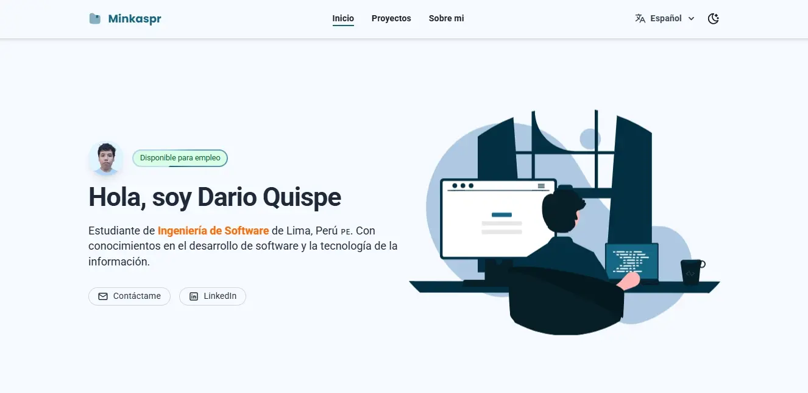

# 📂 Mi Portafolio

Bienvenido a mi portafolio. Aquí encontrarás información sobre mis proyectos, los conocimientos que tengo y las herramientas que uso. El portafolio es multilingüe y se adapta según el idioma seleccionado. Además, cuenta con modo oscuro y claro, y es totalmente responsivo.

## 🛠️ Tecnologías Utilizadas
- Angular 19
- TailwindCSS 4

## 📸 Captura de Pantalla

Visita mi portafolio aquí: [Mi Portafolio](https://dev-highlights.vercel.app/)